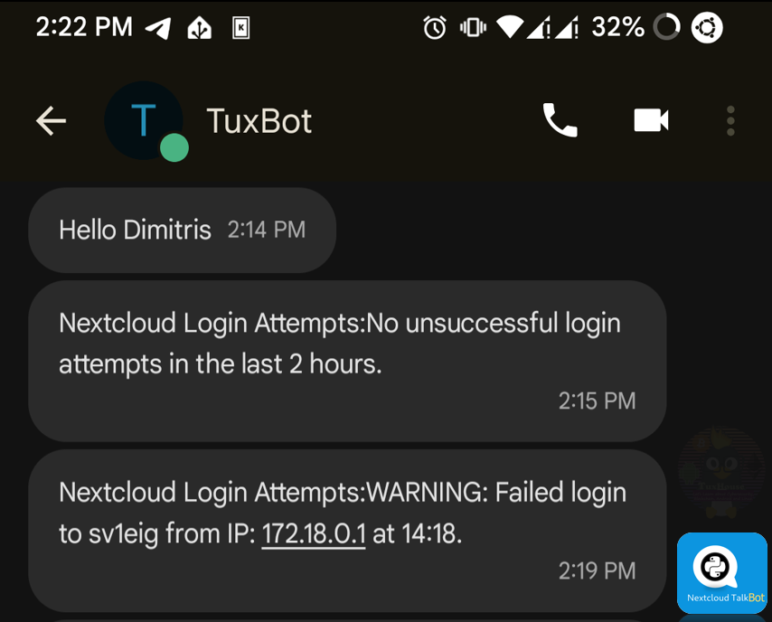
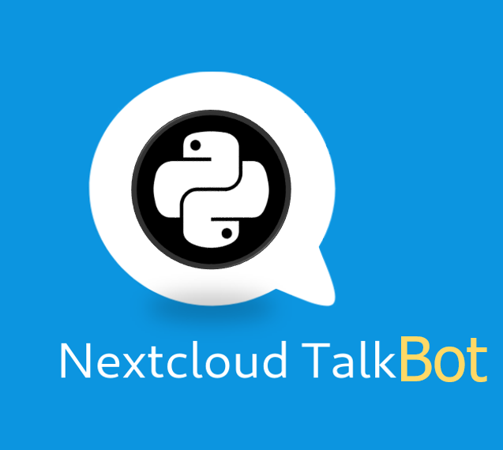

# NextCloudTalkAutomationBot



A powerful and flexible bot for automating tasks and sending messages via Nextcloud Talk 🚀

[](https://www.gnu.org/licenses/agpl-3.0.html)
[](https://www.python.org/downloads/release/python-390/)

Welcome to **NextCloudTalkBot**, a powerful and flexible Python bot that allows you to automate tasks, monitor your system, and send messages via **Nextcloud Talk**.


### ✨ Key Features
- **Automate Messaging**: Send messages to predefined or custom recipients on **Nextcloud Talk** directly from your terminal or via Cronjobs.
- **Monitor Server's Health**: Keep track of key metrics like CPU usage, storage space and system uptime with prebuilt scripts.
- **Docker Log Monitoring**: Get real-time data on **Nextcloud** and **Wireguard** login attempts from container logs.
- **Custom Command Execution**: Run any Bash command and send its output via Nextcloud Talk—perfect for managing remote servers or triggering tasks!
- **Usage Logging**: Automatically logs every command used, making it easier to keep track of bot actions.

## 🎯 Smart Use Cases & Ideas

1. **Server Monitoring**: Integrate this bot with your server monitoring stack to receive alerts or routine system stats directly in a Nextcloud Talk channel.
2. **Team Collaboration**: Automate sending updates or reminders to your team’s chat groups on Nextcloud.
3. **Scheduled Tasks**: Set up a cron job to run routine commands (like checking storage or Docker status) and send the results on NextCloud Talk at regular intervals.
4. **DevOps Integration**: Use the bot to monitor your **Docker** containers and receive real-time alerts on login attempts or potential issues with your server’s security.
5. **Custom Notifications**: Build custom scripts that trigger notifications for key system events—like running out of storage, server uptime, or CPU overload—and send them automatically to your Nextcloud Talk channel.


---
## 🔥 **Lite Edition vs Full Edition** 🔥

| Feature                     | Lite Edition 🎯                 | Full Edition 🏆                |
|-----------------------------|---------------------------------|-------------------------------|
| **Automated Messaging**      | ✅                             | ✅                             |
| **System Monitoring**        | ❌                             | ✅ (CPU, Docker, Storage)      |
| **Docker Log Monitoring**    | ❌                             | ✅                             |
| **Custom Command Execution** | ❌                             | ✅ (Run Bash Commands)         |
| **Ease of Setup**            | 🌟 Just Run the Script         | 🛠️  Set manually the configs   |

---

## 📋 How to Use It

### Installation & Setup
#### Requirements
Ensure you have the following dependencies installed. You can install them easily by running:

```bash
pip install -r requirements.txt
```
#### Environment Setup (`.env` Example)

This bot uses environment variables for secure authentication and configuration. Create a `.env` file in your project directory with the following structure:

```
NEXTCLOUD_URL=https://your-nextcloud-server.com
BOT_USERNAME=your_bot_username
BOT_PASSWORD=your_bot_password
DEFAULT_RECIPIENT_ID=default_recipient_id_for_messages
```

Replace the placeholder values with your actual **Nextcloud** server URL, bot credentials, and default recipient ID. To find recipient ID, open a NextCloud Talk Chat and copy it from the link.

#### Running the Bot

You can interact with the bot via various command-line options:

```bash
python3 nextcloudtalkbot.py [options]
```

### 💡 Available Options & Scripts
The bot supports a wide range of actions, each triggered via specific flags. Here's a quick guide:

- **Send a Message**: Send a message to the default recipient (or specify a recipient ID with `--chat`).
  
  Example:
  ```bash
  python3 nextcloudtalkbot.py --send "Hello from the bot!"
  ```

- **Execute a Command**: Run a Bash command and send its output via Nextcloud Talk.
  
  Example:
  ```bash
  python3 nextcloudtalkbot.py --command "ls -la"
  ```

- **Predefined Scripts**: Run one or more of the built-in scripts for various system tasks.
  
  Available scripts:
  - **storage**: Check available storage on `sda0`.
  - **nextcloud_login**: Fetch failed login attempts from Nextcloud logs within the last 2 hours.
  - **wireguard**: Fetch failed login attempts from Wireguard logs.
  - **boot**: Send a message with the time since the system booted.
  - **status**: Check the status of all running Docker containers.
  - **cpu**: Get the current CPU usage.

  Example (run multiple scripts):
  ```bash
  python3 nextcloudtalkbot.py --script storage status cpu
  ```

- **Specify Chat ID**: Send your message or script results to a custom Nextcloud Talk chat ID:
  
  Example:
  ```bash
  python3 nextcloudtalkbot.py --chat "chat_id" --send "Hey"
  ```

- **Help**: Display help message with all available commands and options.
  
  Example:
  ```bash
  python3 nextcloudtalkbot.py --help
  ```


---

---

## 🔧 Technical Details
### Logging
All bot activity is logged with a timestamp and command details to the `nextcloudtalkbot.log` file in order to track how the bot is being used and find potential issues.

### Security Considerations

The bot uses **environment variables** to store sensitive information like your **Nextcloud** credentials. Ensure that you handle these credentials securely and avoid hardcoding them in your scripts.

---

## 🤝 Contributing
Contributions are welcome! Feel free to fork the repository and submit a pull request. If you encounter any issues, please open an issue on GitHub. 

---

## ⚠️ Troubleshooting
- **Environment Variables Not Loaded**: Ensure you have a valid `.env` file in the root directory.
- **Nextcloud Connection Issues**: Double-check your **NEXTCLOUD_URL**, **BOT_USERNAME**, and **BOT_PASSWORD** values in the `.env` file.
- **Missing Dependencies**: Run `pip install -r requirements.txt` to make sure all required packages are installed.

---

🚀 **NextCloudATalkAutomationBot** –  Created by Dimitris Vagiakakos [@sv1sjp](https://sv1sjp.github.io/whoami) - TuxHouse  
Version 1.03


